# Uses Cases ( How to test each feature in the module )  

There are different ways to parameterize the `terraform-fastly-module` (use case examples) in order to setup `myawesome-test` 
and demonstrate how we can `include/exclude`  different **features** in the module. 

Following pre-requisites are required:

- A S3 bucket
- Public permissions fot the bucket
- An object in the S3 bucket
- Public permission for the object

1. Create an `AWS bucket` named `myawesome-test`
   
   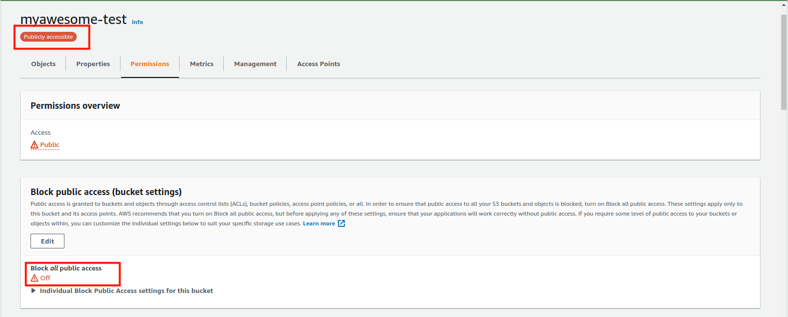
   
2. Grant a public permission to the `myawesome-test` bucket
   
   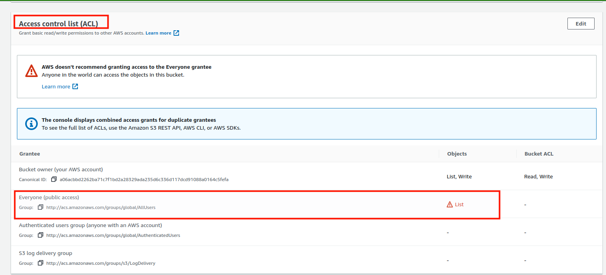
   
3. Upload an `object` image in the bucket
   
   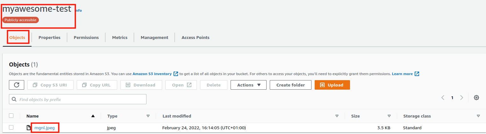
   
4. Grant a public permission to the `object` image
   
   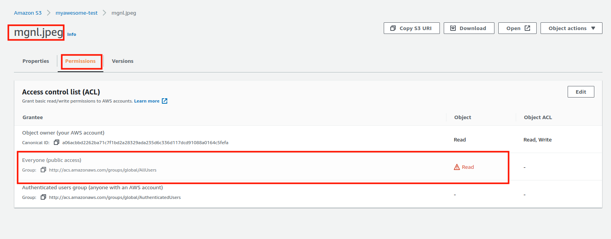
   
5. Access your `object` image from a browser
   
   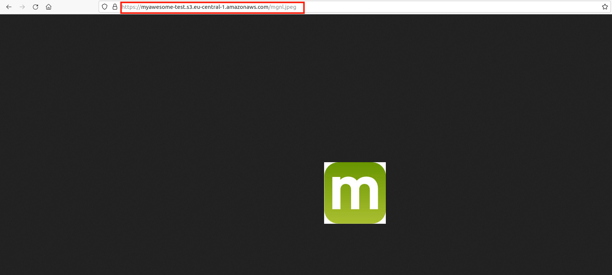

## Use Case 1: Fastly Service without TLS

In order to start with the simplest `fastly service` we can parameterize the `terraform-fastly-module` in the following way:

```
domain = "myawesome-test.exp.magnolia-cloud.com"

service_name       = "magnolia-cloud-myawesome-test-staging"
director           = false
backend_address    = "myawesome-test.s3.eu-central-1.amazonaws.com"
number_of_backends = 1
port               = 80
use_ssl            = false
ssl_cert_hostname  = ""
ssl_check_cert     = false
ssl_sni_hostname   = ""
auto_loadbalance   = false
max_connections    = 1000
override_host      = "myawesome-test.s3.eu-central-1.amazonaws.com"
shield             = null
request_settings   = []
snippets           = []
logging_datadog    = []
service_force_destroy      = true

enable_tls            = false
tls_certificate_authority = "lets-encrypt"
tls_force_update          = true
tls_force_destroy         = true
aws_route_53_record       = null
aws_route_53_validation   = null
```

Once you have parameterized the `terraform-fastly-module` execute the following commands to deploy it:
```
 terraform init
 terraform apply -var-file=use_case_examples/1.uce-1-fastly_service_no_tls.tfvars
```

Finally, we will see the simplest `fastly service` ready, without TLS, snippets, shielding, monitoring ...
   
   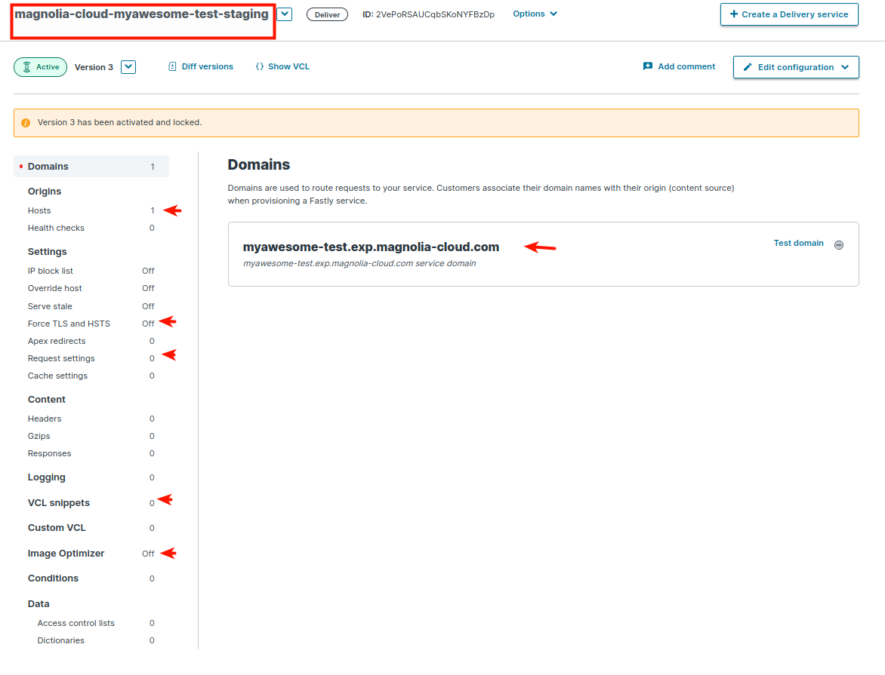

Let's see the fastly service `host`
   
   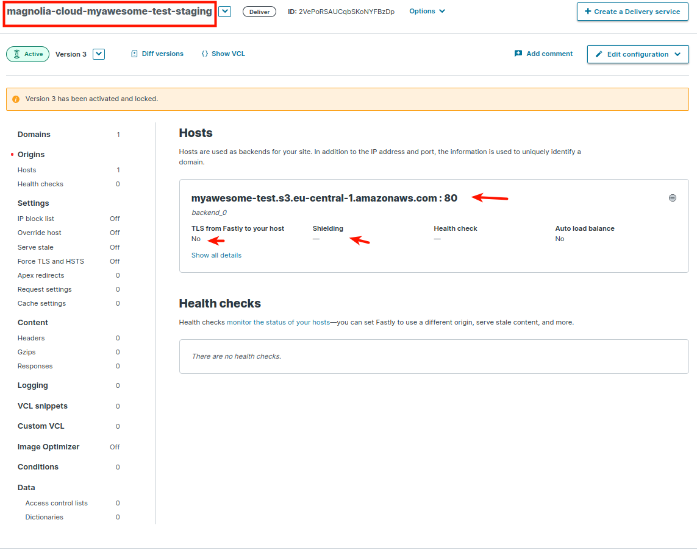

And doing click in `Test domain` we will see the `myawesome-test` and `object` in XML format
   
   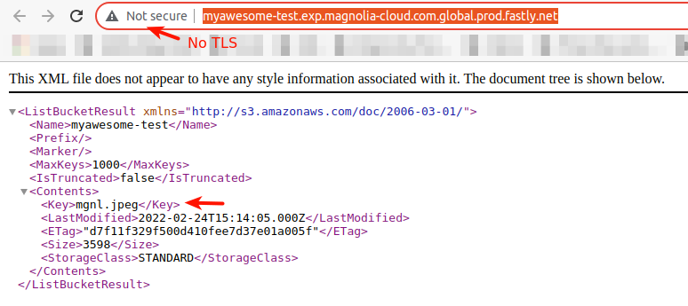

## Use Case 2: Fastly Service with TLS

In order to update our simple `fastly service` without TLS and provide `TLS feature` we need to parameterize the 
`terraform-fastly-module` in the following way:

```
domain = "myawesome-test.exp.magnolia-cloud.com"

service_name       = "magnolia-cloud-myawesome-test-staging"
director           = false
backend_address    = "myawesome-test.s3.eu-central-1.amazonaws.com"
number_of_backends = 1
port               = 443
use_ssl            = true
ssl_cert_hostname  = "*.s3.eu-central-1.amazonaws.com"
ssl_check_cert     = true
ssl_sni_hostname   = "*.s3.eu-central-1.amazonaws.com"
auto_loadbalance   = false
max_connections    = 1000
override_host      = "myawesome-test.s3.eu-central-1.amazonaws.com"
shield             = null
request_settings = [
  {
    name      = "force_ssl"
    force_ssl = true
  }
]
snippets        = []
logging_datadog = []
service_force_destroy   = true

enable_tls            = true
tls_certificate_authority = "lets-encrypt"
tls_force_update          = true
tls_force_destroy         = true
aws_route_53_record = {
  type = "CNAME"
  ttl  = 300
}
aws_route_53_validation = {
  allow_overwrite = true
  ttl             = 60
}
```
Once you have parameterized the `terraform-fastly-module` execute the following commands to deploy it:

```
 terraform init
 terraform apply -var-file=use_case_examples/2.uce-2-fastly_service_tls.tfvars
```

Finally, we will see the `fastly service` upgrade, generating the certificates and more for the `TLS` feature ...

   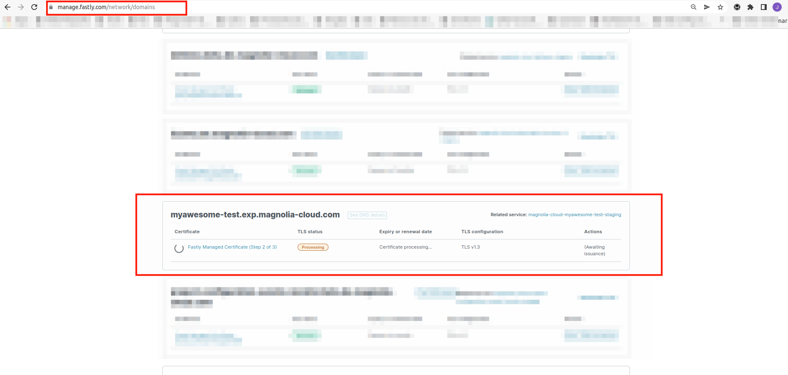

   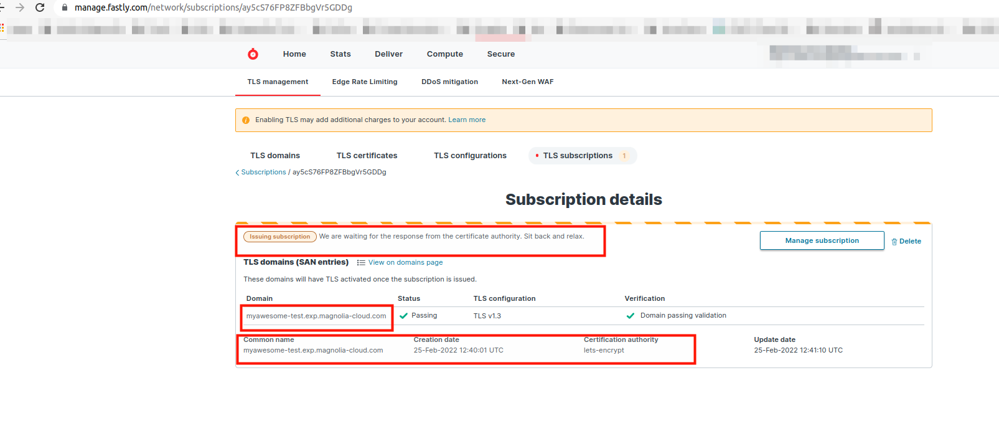
   
Let's check that the AWS Route53 records were created automatically too

   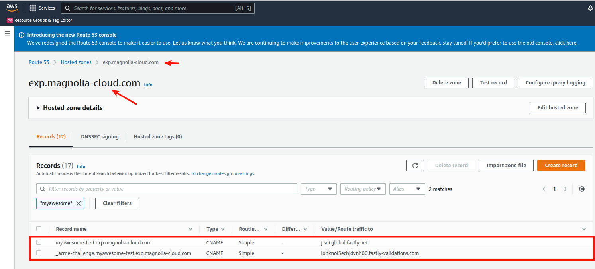
   
Once the records and the validation has been created in `Fastly` we will see the `TLS` for our `fastly service` activated
with the domain specified

   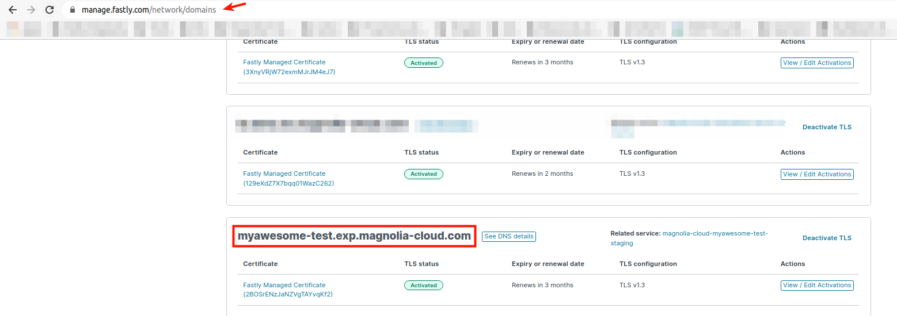

Let's see the fastly service `host` with the detail `TLS` configuration made

   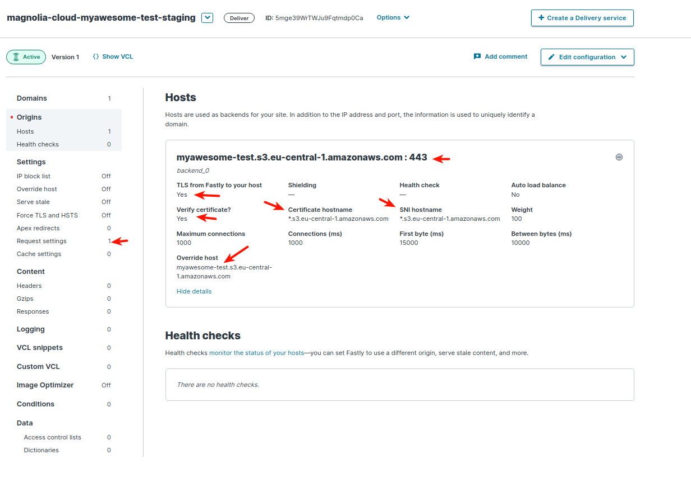
   
Let's explore the `request setting` configuration as well

   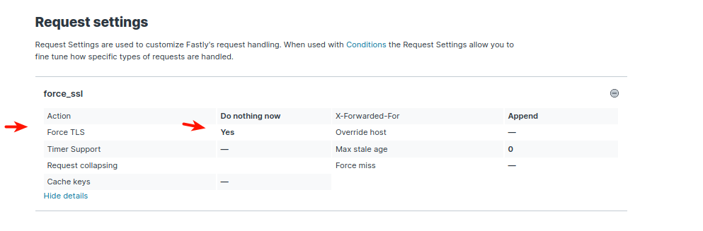

And again doing click in `Test domain` we will see the `myawesome-test` and `object` in XML format with `TLS` (secure)

   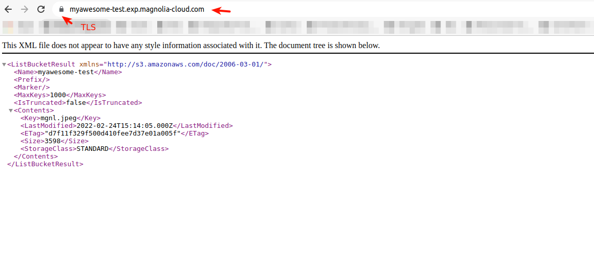
   
Now we can directly access from a `Web Browser` to the `object` image exposed on `Fastly` CDN directly

   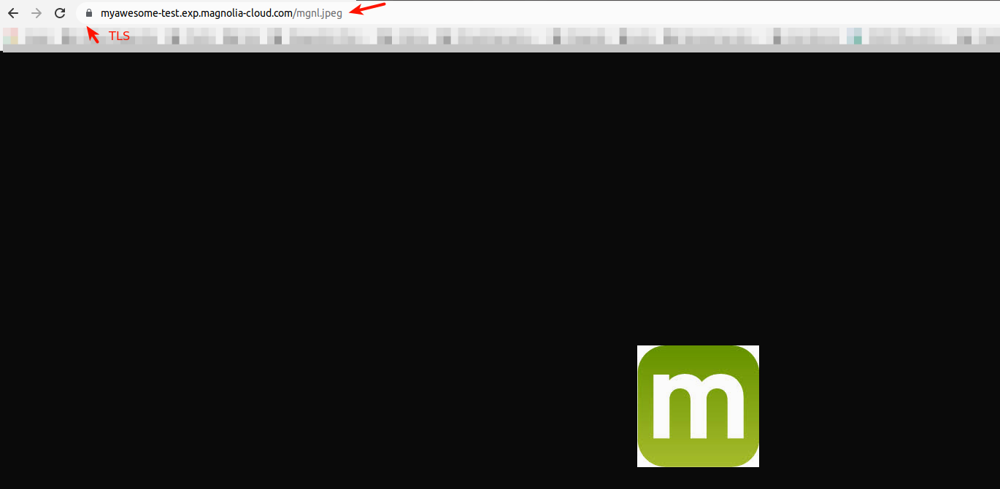

## Use Case 3: Fastly Service with TLS and VCL (Snippets)

We can extend our `fastly service` using VCL language through [regular VCL snippets](https://docs.fastly.com/en/guides/using-regular-vcl-snippets), 
for instance we would like to [keep the content in cache in Fastly and not in browsers](https://developer.fastly.com/learning/concepts/cache-freshness/#cache-in-fastly-not-in-browsers), 
therefore we can extend the previously created `fastly service` by adding the corresponding snippet.

Let's first a request in the Web Browser and let's check the `Request Header` and the key `cache-control` first to verify that feature was enabled:

   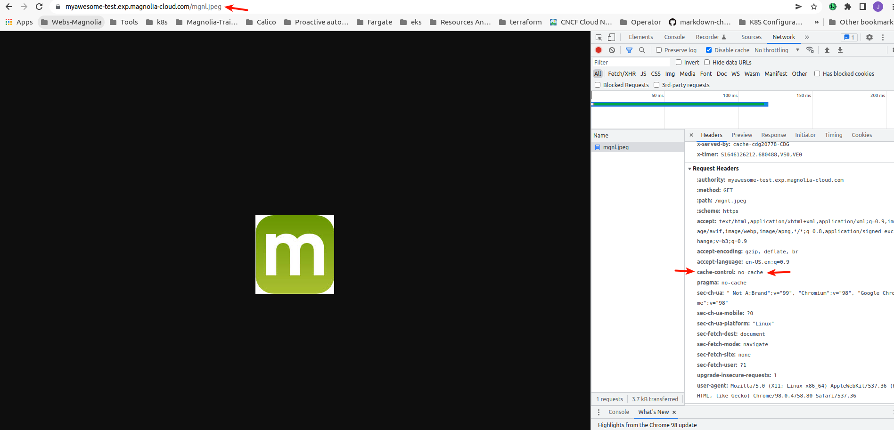

To configure the `terraform-fastly-module` to provide the desired behaviour ([keep the content in cache in Fastly and not in browsers](https://developer.fastly.com/learning/concepts/cache-freshness/#cache-in-fastly-not-in-browsers))
we can do it through a following snippet:

```
domain = "myawesome-test.exp.magnolia-cloud.com"

service_name       = "magnolia-cloud-myawesome-test-staging"
director           = false
backend_address    = "myawesome-test.s3.eu-central-1.amazonaws.com"
number_of_backends = 1
port               = 443
use_ssl            = true
ssl_cert_hostname  = "*.s3.eu-central-1.amazonaws.com"
ssl_check_cert     = true
ssl_sni_hostname   = "*.s3.eu-central-1.amazonaws.com"
auto_loadbalance   = false
max_connections    = 1000
override_host      = "myawesome-test.s3.eu-central-1.amazonaws.com"
shield             = null
request_settings = [
  {
    name      = "force_ssl"
    force_ssl = true
  }
]
snippets        = [
  {
    #https://developer.fastly.com/learning/concepts/cache-freshness/#cache-in-fastly-not-in-browsers
    name     = "Content to be cached by Fastly but not by browsers"
    type     = "fetch"
    priority = 100
    content  = <<EOF
set beresp.http.Cache-Control = "private, no-store"; # Don't cache in the browser
set beresp.ttl = 3600s; # Cache in Fastly
return(deliver);
EOF
  }
]
logging_datadog = []
service_force_destroy   = true

enable_tls            = true
tls_certificate_authority = "lets-encrypt"
tls_force_update          = true
tls_force_destroy         = true
aws_route_53_record = {
  type = "CNAME"
  ttl  = 300
}
aws_route_53_validation = {
  allow_overwrite = true
  ttl             = 60
}
```

Once you have parameterized the `terraform-fastly-module` execute the following commands to deploy it:

```
 terraform init
 terraform apply -var-file=use_case_examples/3.uce-3-fastly_service_tls_snippets.tfvars
```

Applied the configuration above we will see the `fastly service` upgraded

   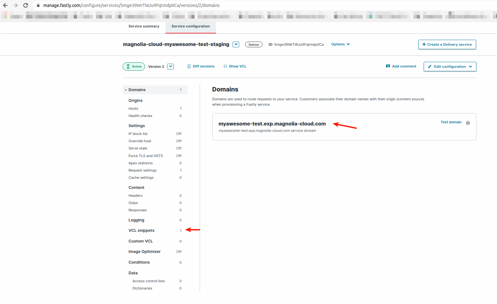

Let's dig into the details, name, type and priority

   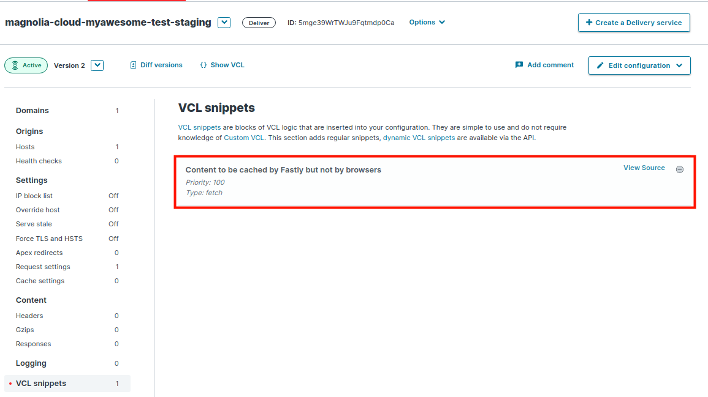

And finally the VCL added to the `fastly service` to have the desired behaviour 

   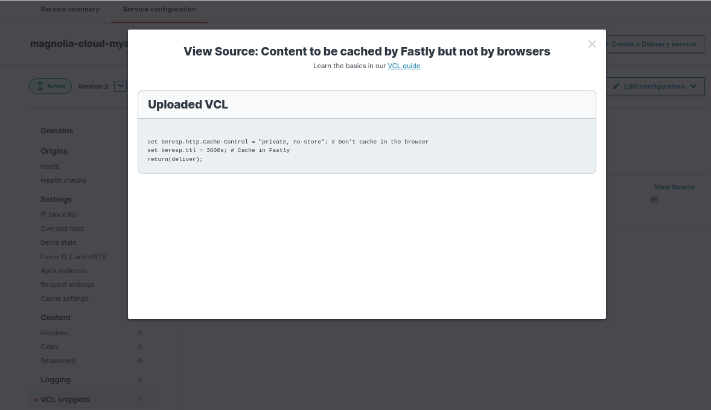
   
To test the `snippets feature` open in a new Browser the `object` and check again the `Request Header` and the key 
`cache-control`, its value must be `private, no-store`

> **TIP**: If you use the same browser to test you will not see the change immediately because we are caching the response

   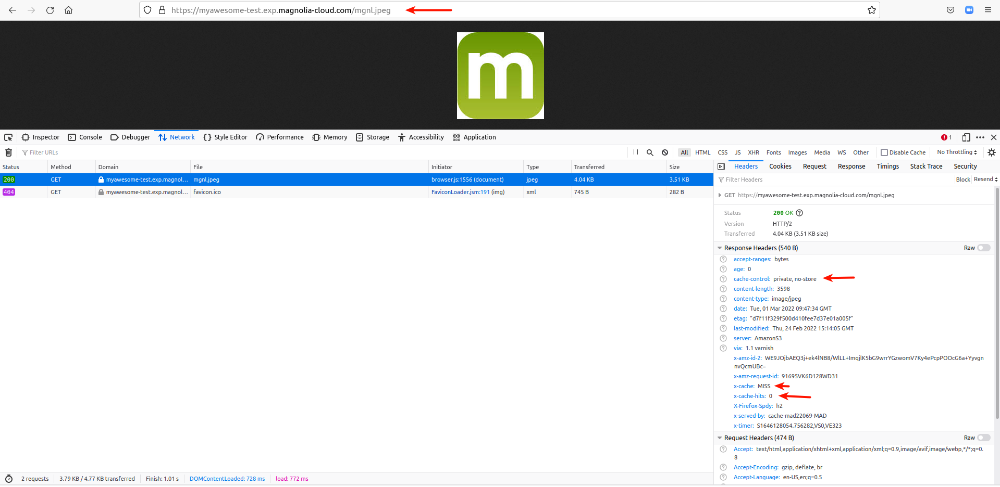


## Use Case 4: Fastly Service with TLS, VCL (Snippets) and director

We can extend our `fastly service` using a [director](https://developer.fastly.com/reference/api/load-balancing/directors/director/),
for instance we would like to 3 backends under a director, therefore we can extend the previous `fastly service` adding 
the corresponding configuration:

```
domain = "myawesome-test.exp.magnolia-cloud.com"

service_name       = "magnolia-cloud-myawesome-test-staging"
#https://developer.fastly.com/reference/api/load-balancing/directors/director/
director           = true
backend_address    = "myawesome-test.s3.eu-central-1.amazonaws.com"
number_of_backends = 3 # Differs of 1 because director = true
port               = 443
use_ssl            = true
ssl_cert_hostname  = "*.s3.eu-central-1.amazonaws.com"
ssl_check_cert     = true
ssl_sni_hostname   = "*.s3.eu-central-1.amazonaws.com"
auto_loadbalance   = false
max_connections    = 1000
override_host      = "myawesome-test.s3.eu-central-1.amazonaws.com"
shield             = null
request_settings = [
  {
    name      = "force_ssl"
    force_ssl = true
  }
]
snippets        = [
  {
    #https://developer.fastly.com/learning/concepts/cache-freshness/#cache-in-fastly-not-in-browsers
    name     = "Content to be cached by Fastly but not by browsers"
    type     = "fetch"
    priority = 100
    content  = <<EOF
set beresp.http.Cache-Control = "private, no-store"; # Don't cache in the browser
set beresp.ttl = 3600s; # Cache in Fastly
return(deliver);
EOF
  }
]
logging_datadog = []
service_force_destroy   = true

enable_tls            = true
tls_certificate_authority = "lets-encrypt"
tls_force_update          = true
tls_force_destroy         = true
aws_route_53_record = {
  type = "CNAME"
  ttl  = 300
}
aws_route_53_validation = {
  allow_overwrite = true
  ttl             = 60
}
```

Once parameterized the `terraform-fastly-module` just run the commands:

```
 terraform init
 terraform apply -var-file=use_case_examples/4.uce-4-fastly_service_director.tfvars
```

We will see in the terraform plan new 2 backends more and the existing one added to a `director`, that is going to be 
added to our `fastly_service`

   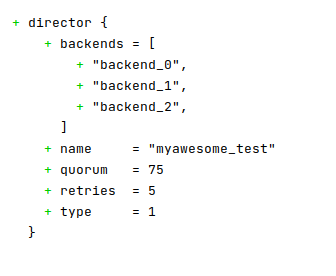

Applied the configuration above we will see the `fastly service` upgraded using a `director` too

   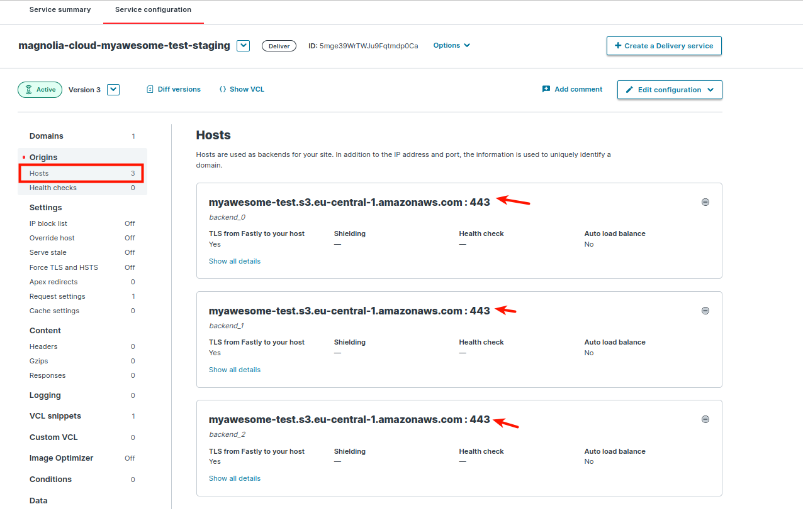


## Use Case 5: Fastly Service with TLS, VCL (Snippets) and shielding

[Shielding](https://docs.fastly.com/en/guides/shielding) is the availability to have [POP (Point of Presence)](https://developer.fastly.com/learning/concepts/shielding/#choosing-a-shield-location) in Fastly to 
get the content from the closest location according to the request origin.

In order to use this feature must be required to activate `Image Optimizer` feature from Fastly

   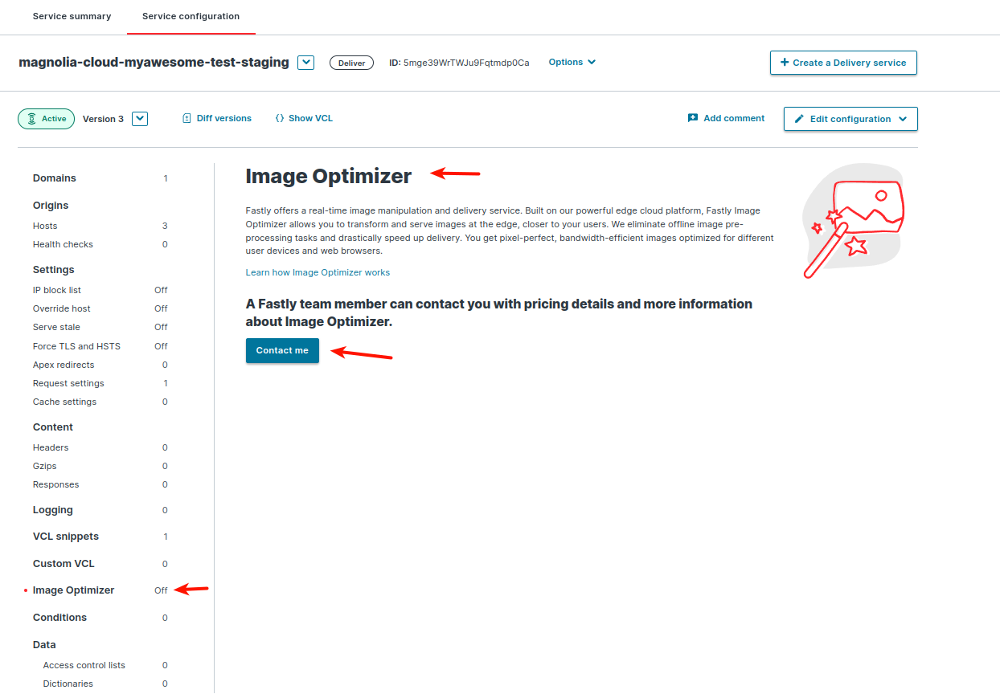

If we check the current `fastly service` created, we are going to see that this feature is disabled in our current setup

   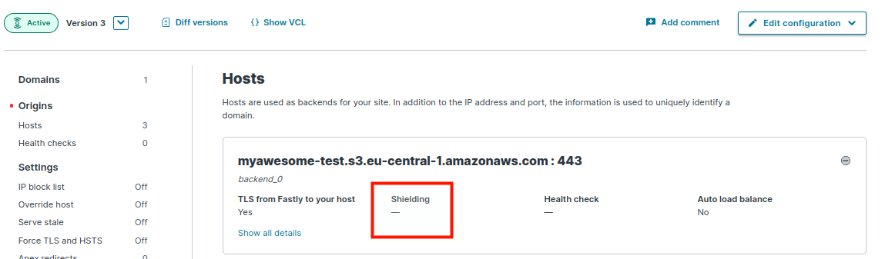

So once requested the `Image Optimizer` feature from Fastly we can proceed to set a POP for our `fastly_service`, it will 
be `frankfurt-de` :

```
domain = "myawesome-test.exp.magnolia-cloud.com"

service_name       = "magnolia-cloud-myawesome-test-staging"
director           = false
backend_address    = "myawesome-test.s3.eu-central-1.amazonaws.com"
number_of_backends = 1
port               = 443
use_ssl            = true
ssl_cert_hostname  = "*.s3.eu-central-1.amazonaws.com"
ssl_check_cert     = true
ssl_sni_hostname   = "*.s3.eu-central-1.amazonaws.com"
auto_loadbalance   = false
max_connections    = 1000
override_host      = "myawesome-test.s3.eu-central-1.amazonaws.com"
#https://developer.fastly.com/learning/concepts/shielding/
shield             = "frankfurt-de"
request_settings = [
  {
    name      = "force_ssl"
    force_ssl = true
  }
]
snippets        = [
  {
    #https://developer.fastly.com/learning/concepts/cache-freshness/#cache-in-fastly-not-in-browsers
    name     = "Content to be cached by Fastly but not by browsers"
    type     = "fetch"
    priority = 100
    content  = <<EOF
set beresp.http.Cache-Control = "private, no-store"; # Don't cache in the browser
set beresp.ttl = 3600s; # Cache in Fastly
return(deliver);
EOF
  }
]
logging_datadog = []
service_force_destroy   = true

enable_tls            = true
tls_certificate_authority = "lets-encrypt"
tls_force_update          = true
tls_force_destroy         = true
aws_route_53_record = {
  type = "CNAME"
  ttl  = 300
}
aws_route_53_validation = {
  allow_overwrite = true
  ttl             = 60
}
```

Once you have parameterized the `terraform-fastly-module` run the following commands for deployment of the module:

```
 terraform init
 terraform apply -var-file=use_case_examples/1.uce-1-fastly_service_no_tls.tfvars
```

After applying the above configuration we will see  `fastly_service` with `shielding`

   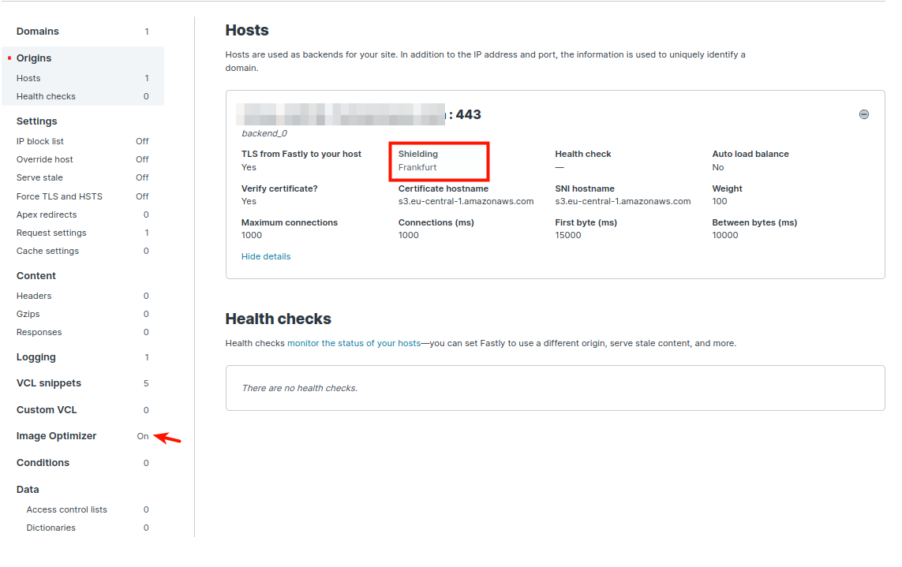


## Use Case 6: Fastly Service with TLS, VCL (Snippets) and monitoring (Datadog)

`terraform-fastly-module` covers the monitoring feature by using a [custom template](https://git.magnolia-cms.com/users/jvalderrama/repos/fastly_service/browse/monitoring/datadog/access_log_format_fastly.tpl)
for **Datadog** in order to push logs and related information. The important part to configure this is to set the correct 
`token` and `region` in the `login_datadog` variable object:

```
domain = "myawesome-test.exp.magnolia-cloud.com"

service_name       = "magnolia-cloud-myawesome-test-staging"
director           = false
backend_address    = "myawesome-test.s3.eu-central-1.amazonaws.com"
number_of_backends = 1
port               = 443
use_ssl            = true
ssl_cert_hostname  = "*.s3.eu-central-1.amazonaws.com"
ssl_check_cert     = true
ssl_sni_hostname   = "*.s3.eu-central-1.amazonaws.com"
auto_loadbalance   = false
max_connections    = 1000
override_host      = "myawesome-test.s3.eu-central-1.amazonaws.com"
shield             = null
request_settings = [
  {
    name      = "force_ssl"
    force_ssl = true
  }
]
snippets        = [
  {
    #https://developer.fastly.com/learning/concepts/cache-freshness/#cache-in-fastly-not-in-browsers
    name     = "Content to be cached by Fastly but not by browsers"
    type     = "fetch"
    priority = 100
    content  = <<EOF
set beresp.http.Cache-Control = "private, no-store"; # Don't cache in the browser
set beresp.ttl = 3600s; # Cache in Fastly
return(deliver);
EOF
  }
]
logging_datadog = [
  {
    name   = "datadog-myawesome-test-staging"
    token  = "XXXXXXXXXXXXXXXXXXXXXXXXXXXXX"
    region = "EU"
  }
]
service_force_destroy   = true

enable_tls            = true
tls_certificate_authority = "lets-encrypt"
tls_force_update          = true
tls_force_destroy         = true
aws_route_53_record = {
  type = "CNAME"
  ttl  = 300
}
aws_route_53_validation = {
  allow_overwrite = true
  ttl             = 60
}
```

Once you have parameterized the `terraform-fastly-module` execute the following commands to deploy it:

```
 terraform init
 terraform apply -var-file=use_case_examples/1.uce-1-fastly_service_no_tls.tfvars
```

After applying the above configuration we will see out `fastly_service` with `monitoring` in `Datadog` platform

   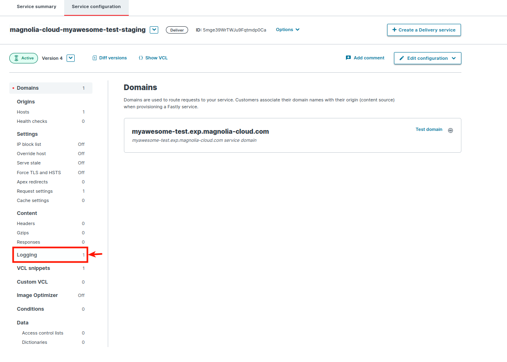

Let's check the details 

   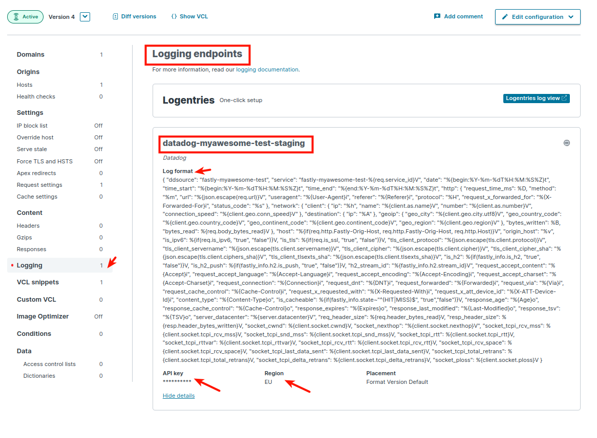


That's all .....


